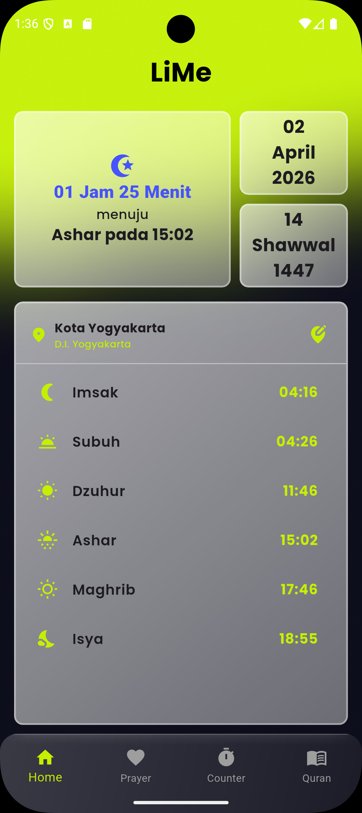
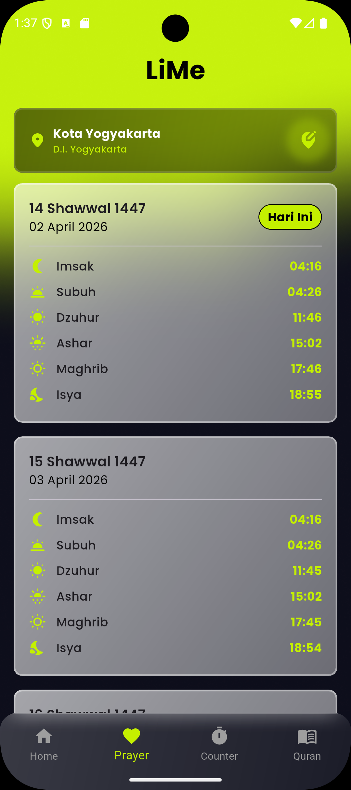
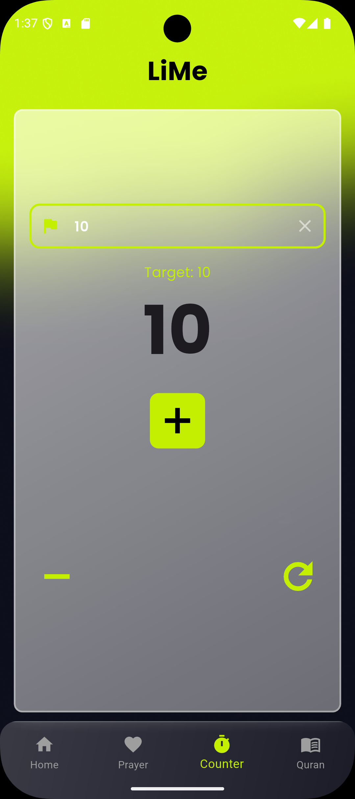
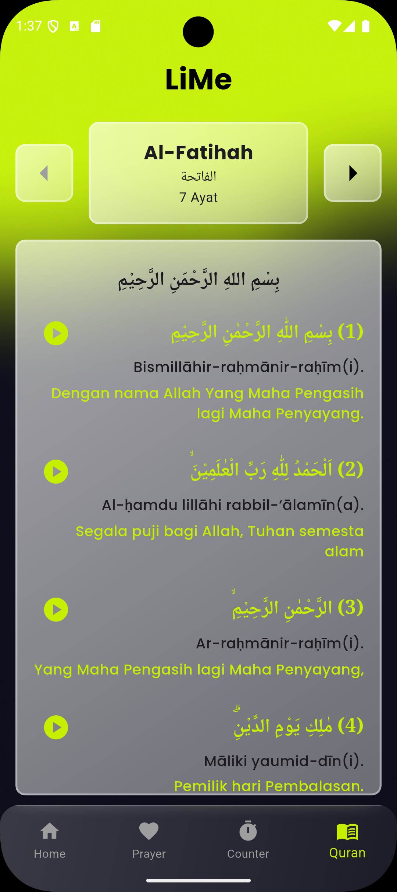

# 🕌 LIME : musLIm tiME

LIME (musLIm tiME) adalah aplikasi mobile yang dirancang untuk membantu umat Muslim dalam menjalankan ibadah sehari-hari. Mulai dari pengingat waktu sholat yang akurat, penghitung dzikir, hingga kemudahan membaca Al-Quran, LIME hadir sebagai asisten ibadah digital Anda.

🔗 **Repository:** [https://github.com/Iq11k/LiMe](https://github.com/Iq11k/LiMe)

---

## ✨ Fitur Utama

Aplikasi ini dilengkapi dengan 4 fitur utama untuk menunjang kebutuhan ibadah:

1. **Waktu Sholat Hari Ini & Estimasi Terdekat** Menampilkan jadwal sholat harian secara akurat. Fitur ini juga dilengkapi dengan hitung mundur atau estimasi waktu menuju waktu sholat berikutnya agar Anda selalu siap tepat waktu.

2. **Jadwal Sholat Mendatang** Menampilkan jadwal waktu sholat untuk hari-hari berikutnya, memudahkan Anda dalam merencanakan aktivitas harian tanpa khawatir tertinggal waktu ibadah.

3. **Tasbih Counter** Fitur penghitung dzikir digital (tasbih) yang praktis, intuitif, dan mudah digunakan kapan saja dan di mana saja.

4. **Al-Quran Digital Terpadu** Menyediakan teks ayat-ayat suci Al-Quran yang dilengkapi dengan terjemahan untuk pemahaman yang lebih dalam, serta fitur pemutaran audio (murattal) untuk mendengarkan bacaan ayat.

---

## 🔌 Sumber Data & API (API Reference)

Aplikasi LIME menggunakan layanan API dari pihak ketiga untuk menyediakan data yang lengkap dan akurat:
* **[EQuran.id](https://equran.id/)** - Digunakan sebagai sumber data utama untuk mengambil teks ayat-ayat suci Al-Quran, terjemahan, serta file audio (murattal). Kami mengucapkan terima kasih kepada developer EQuran.id atas layanan API luar biasa yang mereka sediakan.

---

## 🚀 Cara Unduh & Instalasi (Untuk Pengguna)

Aplikasi LIME sudah dapat diunduh dan langsung diinstal di *smartphone* Android Anda.

1. Buka halaman **[Releases](https://github.com/Iq11k/LiMe/releases)** di repositori ini.
2. Pada rilis versi terbaru, lihat di bagian **Assets** dan unduh file lime.1.0.0.apk.
3. Buka file `.apk` yang sudah diunduh di perangkat Android Anda.
4. *Catatan:* Jika muncul peringatan keamanan, Anda mungkin perlu mengizinkan instalasi dari sumber yang tidak dikenal (*Install from Unknown Sources*) di pengaturan keamanan HP Anda.
5. Lanjutkan instalasi hingga selesai, dan LIME siap menemani ibadah Anda!

---

## 🛠️ Pengembangan Lokal (Untuk Developer)

Jika Anda ingin menjalankan atau memodifikasi aplikasi ini di lingkungan pengembangan lokal Anda:

1. **Clone repositori ini:**
   ```bash
   git clone [https://github.com/Iq11k/LiMe.git](https://github.com/Iq11k/LiMe.git)
2. **Buka proyek:** Buka folder proyek menggunakan IDE Android Studio.
3. **Sinkronisasi dependencies:** Tunggu proses sinkronisasi Gradle selesai untuk memastikan semua library dan dependencies sudah terunduh dengan baik.
4. **Jalankan aplikasi:** Build dan run aplikasi pada emulator atau perangkat fisik (smartphone) yang terhubung ke komputer Anda.
---

## 📱 Tangkapan Layar (Screenshots)
<p align="center">
  
  
  
  
</p>

## 👨‍💻 Pengembang
Moch Rizqi Ardi Saputra Bambang 

Email: mochrizqiardisb@gmail.com

GitHub: [@Iq11k]()

Jika Anda memiliki masukan, saran, atau menemukan bug, silakan buat Issue di repositori ini. Kontribusi sangat diapresiasi!